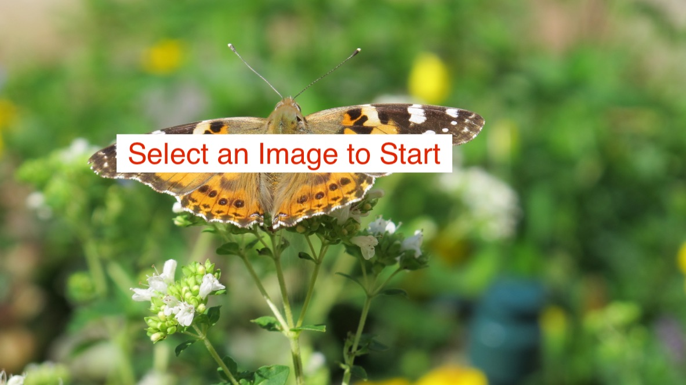

# image-clf-keras-shiny
Source code for the app https://jasminedumas.shinyapps.io/image_clf/
_Blog post published February 20, 2018_: https://jasdumas.github.io/2018-02-20-deep-learning-img-classifier/

## How to use?

1. Upload an image from your local machine
2. Classify
3. Explore the predicted classes on ImageNet

> Dumas, Jasmine. “Butterfly.” Deep Learning Image Classification with Keras and Shiny, 20 Feb. 2018, github.com/jasdumas/image-clf-keras-shiny/blob/master/www/butterfly.jpg. **Canon G12.**

## Contact Me

Jasmine Dumas | [@jasdumas](https://twitter.com/jasdumas) | [jasdumas.github.io](http://jasdumas.github.io/)

